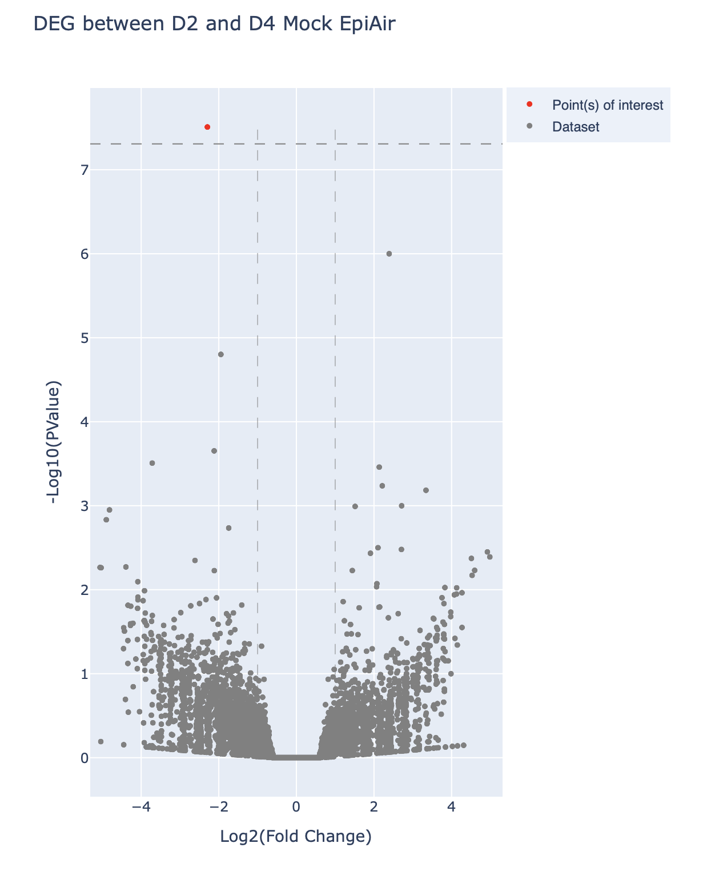

# Differentially expressed genes plot

DEG show statistically significant differences in expression levels between two or more conditions, such as 
different tissues, treatments, or disease states.

## Result
The Volcano plot on the left demonstrates two DEGs, Downregulated gene PHACTR3 and upregulated gene CXCL5. 
The remaining genes show no significance between two samples, indicated by its padj and l2fc values.



Looking at the padj in the data, we can see that only the first three genes have adj values lesser than 1.
This might be that the raw p-values are not significantly small enough, combining with the fact that there
are a lot of genes, this indicate that the padj will skew over to be 1 --> not DEG at all.

## Walkthrough

First, make sure you have installed an environment with suitable packages for this visualization.

To install a virtual environment using Python3 and activate it:

```python3 -m venv <env_name>
source <env_name>/bin/activate```


To install related packages:
```pip install pandas plotly dash dash_bio```


Next, create simple Dash app with VolcanoPlot, the tutorial can be found here.
Designate a port on your localhost:
```app.run_server(debug=True, port=8050)```

To run the app, make sure you know where's the data (and the format):
```python3 app.py --data_path <path_name>```

